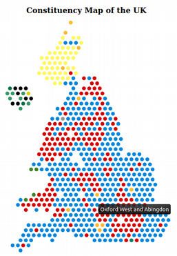

# ConstituencyMap
A map of UK parliamentary constituencies created in D3

## How to run
1. Clone this repository
2. Navigate to the [`map`](./map) directory in the repository and run a server. This can be done by:
    - Using a plugin on a JavaScript IDE
    - Run `python -m http.server` in the terminal
3. Navigate in a browser to the localhost which contains the application

## TODO
- [x] Offset constituency circles on alternate rows
- [x] Fit map to SVG size
    - [ ] Do this dynamically (without hard-coded numbers)
- [x] Combine map data with 2019 parliamentary results (pre-JS/d3)
    - [ ] Do this step in D3
- [ ] Fill in missing constituencies in hexmap
- [x] Colour circles by party
- [ ] Add legend
- [ ] Use hexagons instead of circles
- [ ] Make constituencies interactive

## Data
- `uk_hex.csv`
    - Coordinates of UK parliamentary constituencies (2017 boundaries) in hexmap format
    - Created by [ODILeeds](https://odileeds.org/projects/hexmaps/constituencies/),
    released under MIT license
- `HoC-ge2019.csv`
    - Results of the 2019 UK General Election
    - Provided by [HoC library](https://commonslibrary.parliament.uk/research-briefings/cbp-8749/)
- `combined_ge2019.csv`
    - Merged `uk_hex.csv` and `HoC-ge2019.csv`
    - Removed some unused fields, such as individual part votes, from combined dataset
    - **Note**: Not all constituencies are present in both files.
    I believe this is because the ODI map uses the old (2017) boundaries.
    The hexmap will need to be updated.
